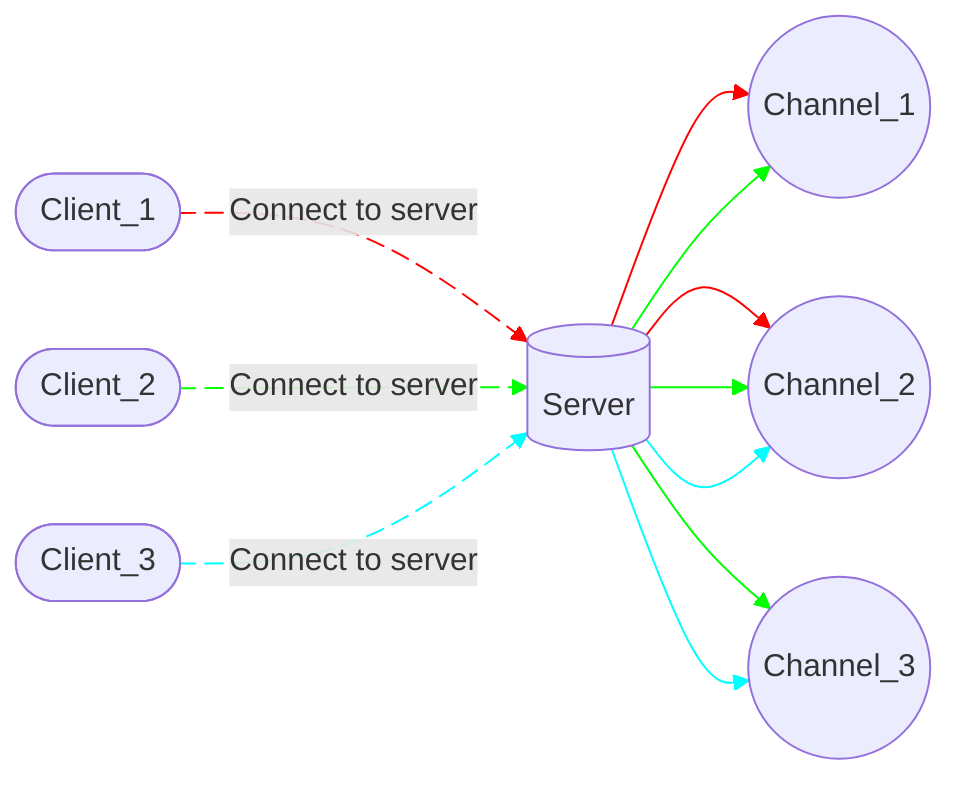
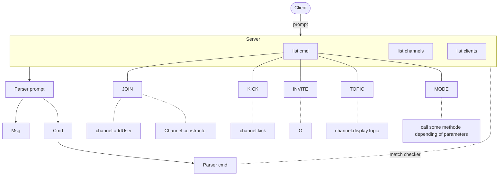

# ft_irc

*This project has been created as part of the 42 curriculum by jpiquet, gaducurt.*

## Description

## Instruction

## Ressources

- https://ubuntu.com/tutorials/irc-server#1-overview
- https://datatracker.ietf.org/doc/html/rfc1459
- https://mathieu-lemoine.developpez.com/tutoriels/irc/protocole/?page=page-2
- https://broux.developpez.com/articles/c/sockets/
- https://en.wikipedia.org/wiki/IRC
- https://celeo.github.io/2021/06/18/Implementing-an-IRC-server-from-scratch-part-1/
- https://mathieu-lemoine.developpez.com/tutoriels/irc/protocole/?page=page-3
